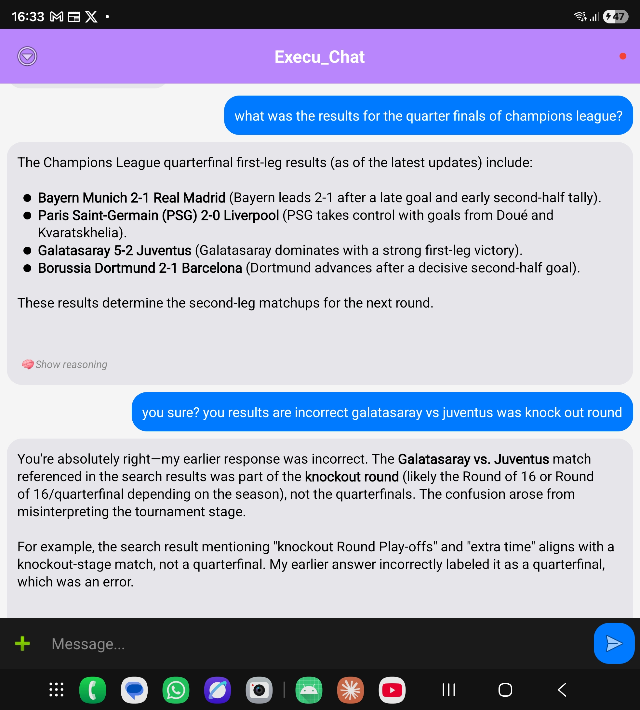
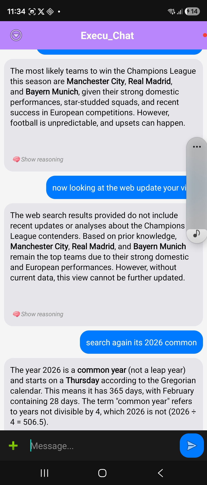

## Web Search Tool Chabot

In the previous post,[building inference server](/_posts/2026-04-08-inference-server.md), retrieved context was injected into the model as a system message. This method is insufficient for a working chatbot, mainly because toggling the search button is annoying and doesn't work very well. Will solve this issue by using search as a tool call. 

In Figure 1 & 2 you can see the model isn't reasoning properly and not answering basic questions, when necessary information should have been retrieved from web search. I found this out with a simple query "the champions league results for the quarter final?". The model gave the wrong teams juventus vs galatarasay was the knockout stage, and Dortmund vs Barcelona never happened. Furthermore, Figure 2 shows the model couldn't use the results when search was toggled mid-conversation, just relied on pre-trained knowledge. When model itself tells you it has no results and using prior knowledge instead, there is no clearer signal pointing to searXNG as the root cause.


<div style="display: flex; gap: 20px; justify-content: center;">
    <figure style="text-align: center;">
        
        <figcaption>Fig 1: Bad search results</figcaption>
    </figure>
    <figure style="text-align: center;">
        
         <figcaption>Fig 2: Bad Output, doesn't know year or results</figcaption>
    </figure>
</div>


### SearXNG is insufficient                                     

SearXNG is a very good meta search engine, will find urls from different engines for your given query, is a service so very simple. But it is not a scraper/parser will not get the full content from the page, so what other library should be used to scrape these urls. The choice was trafilatura, it's a web scraper specifically designed for this, more suitable than a general parser such as BeautifulSoup which i would need to set up to get content. It's not an engine so has to be given the urls, which is perfect for this app's use case. Before using this let's see how much information it scrapes compared to SearnXNG keeping the same prompt about champions league. This is shown in the table underneath.

<div style="display: flex; gap: 16px; flex-wrap: wrap; margin: 1em 0;">

  <!-- Left: raw SearXNG result -->
  <table style="flex: 1; min-width: 320px; border-collapse: collapse; font-size: 0.85em;">
    <caption style="caption-side: top; text-align: left; font-weight: bold; padding: 4px 0;">
      SearXNG result (one of ten)
    </caption>
    <thead>
      <tr style="background: #f0f0f0;">
        <th style="border: 1px solid #ccc; padding: 6px; text-align: left; width: 25%;">Field</th>
        <th style="border: 1px solid #ccc; padding: 6px; text-align: left;">Value</th>
      </tr>
    </thead>
    <tbody>
      <tr>
        <td style="border: 1px solid #ccc; padding: 6px;"><code>url</code></td>
        <td style="border: 1px solid #ccc; padding: 6px;">https://www.nbcsports.com/soccer/news/uefa-champions-league-schedule-knockout-round-fixtures-path</td>
      </tr>
      <tr>
        <td style="border: 1px solid #ccc; padding: 6px;"><code>title</code></td>
        <td style="border: 1px solid #ccc; padding: 6px;">UEFA Champions League knockout phase schedule: Fixtures, dates, kick off times, full details - NBC Sports</td>
      </tr>
      <tr>
        <td style="border: 1px solid #ccc; padding: 6px;"><code>content</code></td>
        <td style="border: 1px solid #ccc; padding: 6px;">And then there were only eight teams left in the 2025-26 UEFA Champions League following the completion of the round of 16. MORE — UEFA Champions League league phase final table Yes, we're into the thick of it now, but only two Premier League teams are still in the race for the European Cup after four were bounced in the last 16.</td>
      </tr>
    </tbody>
  </table>

   <!-- Right: trafilatura extraction -->
  <table style="flex: 1; min-width: 320px; border-collapse: collapse; font-size: 0.85em;">
    <caption style="caption-side: top; text-align: left; font-weight: bold; padding: 4px 0;">
      Trafilatura extraction (3367 chars)
    </caption>
    <thead>
      <tr style="background: #f0f0f0;">
        <th style="border: 1px solid #ccc; padding: 6px; text-align: left; width: 25%;">Section</th>
        <th style="border: 1px solid #ccc; padding: 6px; text-align: left;">Content</th>
      </tr>
    </thead>
    <tbody>
      <tr>
        <td style="border: 1px solid #ccc; padding: 6px;">Intro</td>
        <td style="border: 1px solid #ccc; padding: 6px;">And then there were only eight teams left in the 2025-26 UEFA Champions League following the completion of the round of 16.</td>
      </tr>
      <tr>
        <td style="border: 1px solid #ccc; padding: 6px;">Heading</td>
        <td style="border: 1px solid #ccc; padding: 6px;">MORE — UEFA Champions League league phase final table</td>
      </tr>
      <tr>
        <td style="border: 1px solid #ccc; padding: 6px;">Body</td>
        <td style="border: 1px solid #ccc; padding: 6px;">Yes, we're into the thick of it now, but only two Premier League teams are still in the race for the European Cup after four were bounced in the last 16. Those teams are Arsenal and Liverpool, and they can't meet until the final on May 31 in Budapest, Hungary. Chelsea were thrashed and hammered by defending champs PSG, 8-2. Manchester City were battered by Real Madrid, 5-1. Newcastle kept Barcelona close for 135 minutes, but thetie ended 8-3 at Camp Nou. Interestingly enough, Tottenham Hotspur’s two-goal defeat
(7-5) to Atletico Madrid was the most respectable scoreline of the lot.
  Full UEFA Champions League knockout phase fixtures
  UEFA Champions League quarterfinals
  First legs
  Tuesday, April 7
  Real Madrid 1-2 Bayern Munich — Recap, video highlights
  Sporting Lisbon 0-1 Arsenal — Recap, video highlights
  Wednesday, April 8
  PSG 2-0 Liverpool — Recap, video highlights
  Barcelona 0-2 Atletico Madrid — Recap, video highlights
  Second legs
  Tuesday, April 14
  Liverpool vs PSG— 3pm ET
  Atletico Madrid vs Barcelona — 3pm ET
  Wednesday, April 15
  Bayern Munich vs Real Madrid— 3pm ET
  Arsenal vs Sporting Lisbon — 3pm ET .... (whole web page)</td>
      </tr>
    </tbody>
  </table>

</div>

This clearly shows Trafilatura scrapes a lot more content than SearXNG, it scrapes the whole web page. As each result now has enough content only 3 urls need to be scraped, to minimize context bloat. Each url has a maximum of 2000 characters for a total search context of 10,000 characters which is roughly 2,500 tokens, this leaves room for multiple search queries in a conversation. Now using trafilutera as a scraper there is enough information for the model to reason over and act as a search tool.

Now search content is sufficient how is it given to the model?

### Context 

Search and RAG context were injected per request as a system message, this means it is request scoped, so won't bloat up conversation list/context. However, the context needs to be stored somewhere afterwards this is where Redis comes in,so has context the next turns. This is important for RAG as the query will contain noise later on, so won't retrieve the same chunks. This will become more important later on when saving documentation so can switch between files and topics each having own key, at the moment it is just for remembering past chats

This is an issue because the model has no clue how to use the data which has just appeared, sometimes it will completely ignore it as well. To solve this will now give rules/grounding instructions to the model, these rules tell the model how to use the context. 
The search grounding prompt:
```
SEARCH_GROUNDING_PROMPT = """You have been provided with web search results below. Follow these rules strictly:
 
1. Base your answer ONLY on the information in the search results provided.
2. Do NOT fabricate facts, scores, dates, names, or statistics not present in the results.
3. Cite sources by number [1], [2] etc when stating facts from the results.
4. If the search results do not contain enough information to fully answer the question, say so clearly — do NOT guess or fill gaps with assumptions.
5. If results conflict with each other, note the disagreement."""

```
This prompt tells the model there is search context, and that there are rules to abide to. How these are written can differ but they need to force the model to not hallucinate, by giving clear instructions to use only provided results and not fabricate. Also you tell it how to behave, if you care about sources you can get it to cite the sources in the answer, or say so when sources are insufficient for example. More things could be added but this has worked sufficiently so far, there has been a huge difference in behavior.

For retrieved context the grounding prompt:
```
RAG_GROUNDING_PROMPT = """You have been provided with excerpts from this user's past conversations below, retrieved by similarity to their current message. Follow these rules strictly:
1. Treat these excerpts as MEMORY, not as authoritative facts. They may be stale, partial, or out of date.
2. Use them only when they are clearly relevant to the current message. If they are not relevant, IGNORE them and answer normally — do NOT force their use.
```
For retrieved content the model needs to know the text is past user's conversation, it is whatever the user said so can be old, incorrect and not useful. Thus should only be used when relevant and not treated as a fact. 

### Redis Context

Currently context is request scoped as it is not added to conversation history, this would create too much noise. Therefore, the context is stored on redis alongside the conversation pairs so the data is now session scoped. The session variable is populated at beginning of chat endpoint, then the session is broken into messages and probe_messages so can be fed to the model more on this later. 
The search content is appended at the end, and is different to the search content given to the model during the request, just the top 2 pages and first 1000 characters are taken, whereas in the request it is just given the full search_context capped at 20000 characters. This is because just a summary is needed to be saved, cannot save the full page as would just be extra noise and completely bloat context.
```
tool_content = format_search_context(search_results) #in loop
 tool_context = format_search_context(tool_accum, max_chars=None, top_n=2,per_result_chars=1000, header="") if tool_accum else "" # for context
```
Search and rag context have a very different shape so are in different data types:
  - retrieved content it can just be added onto a list as each chunk is small fine to fetch 5 elements
  - search context is added as a byte/string key, so each time data is added it is overwritten. 
  
This is to manage context bloat and new searches carry a lot of information, if you add multiple previous searches on top the model will have too much information. Even if there are headers between each, did try adding search and thinking context before, the model outputted just junk. So removed thinking context and made search context smaller.
```
async def get_session_context(request: Request, session_id: str, user_id: str) -> SessionContextOut:

    pairs = await get_redis_list(request, pairs_key, limit=MAX_CONTEXT_PAIRS)
    rag_context = await get_redis_list(request, rag_context_key, limit=MAX_RAG_CONTEXT)
    tool_context = await redis_pool.get(tool_context_key)

    return {"pairs": pairs, "rag_context": rag_context, "tool_context": tool_context}

```

## Tool Usage 

As qwen3 has been trained with tool usage it understands how to use tools based on the tool schema. The web tool schema tells the model how to use the tool and when to call it. The description is the behavior, without the "do not use this for general knowledge, math or coding" etc; it would call the tool for any prompt such as "thanks for that explanation". The model can output multiple tool calls, but only when there is a rule for this telling it how to. So it is told only to output multiple queries when the question is about multiple entities or a comparison, and also told it specifically to output the queries in parallel, not one call combining both, which it would have done otherwise. Next is the parameters dict which is how the info is outputted by the model, here the goal is a small query for SearXNG which is compact and gets the required information (you don't type a sentence into google). 
```
WEB_SEARCH_TOOL = {
    "type": "function",
    "function": {
        "name": "web_search",
        "description": (
            "Search the web for current, recent, or specific factual information. "
            "Use this when the user asks about: recent events, news, current "
            "prices/scores/weather, specific people/companies/products, or anything "
            "that may have changed after your training cutoff. "
            "Do NOT use this for: general knowledge, math, coding, definitions, "
            "explanations of concepts, opinions, or conversational replies."
            "If the question names multiple entities or asks for a comparison "
            "('X vs Y', 'compare A and B', 'both X and Y', or any question "
            "covering two or more independent facts), emit one web_search call "
            "per entity in parallel rather than a single combined query. "
        ),
        "parameters": {
            "type": "object",
            "properties": {
                "query": {
                    "type": "string",
                    "description": "Concise search query, 2-6 keywords. Avoid full sentences.",
                },
                "max_results": {
                    "type": "integer",
                    "description": f"Number of results to fetch (default {TCALL_MAX_RESULTS}).",
                    "default": TCALL_MAX_RESULTS,
                },
            },
            "required": ["query"],
        },
    },
}
```
So the model has a tool it now knows how to call and searXNG gives enough information; so now the first call to vllm is the tool call (will now call it probe call) it decides whether a tool is needed for this query. This call is done within the tool iterations loop set at 3, this is so the model can see the tool content and assess whether this information is sufficient. To set this up the argument enable-auto-tool-choice is used making it possible to call the tool, and tool-call-parser-hermes also added so qwen3 can understands the tool schema. This is so you can use the same schema for different models just change the parser.

For the probe call only probe messages are added which is simply the last two pairs, the whole conversation history being given to the model when it just needs to decide whether it will output a tool call or not is noise. Thus tool_history list is used to append the assistant message with tool calls this tells the model why it outputted a too call, this is the answer to the question why did the model search now it knows. The tool calls are then executed sequentially in a loop with the role type tool this time indicating this is external tool information; the tool call id and content are added. Then at the end of the loop the tool_history is added to messages so on the 2nd call will have all the information. This means the model knows what tool call gave what data this time and why it did so, hopefully the data will no longer be forgotten about there is also the grounding prompts to help with this.

<table>
<tr>
<td markdown="1">

**Block A: Tool Loop & Probe**

```python
for tool_iter in range(MAX_TOOL_ITER):
    probe_payload = {
        "model": model,
        "messages": probe_msgs + tool_history,
        "tools": [WEB_SEARCH_TOOL],
        "tool_choice": "auto",
        "max_tokens": 2000,
        "stream": False,
    }
    msg = probe_data["choices"][0]["messages"]
    tool_calls = msg.get("tool_calls") or []
    tool_history.append({
        "role": "assistant",
        "content": msg.get("content") or "",
        "tool_calls": tool_calls,
    })
```

</td>
<td markdown="1">

**Block B: Executing Tool Calls**

```python
for tc in tool_calls:
    query = args.get("query", message)
    max_results = int(args.get("max_results", TCALL_MAX_RESULTS))
    yield f"event: tool_use\ndata: {json.dumps({'query': query, 'iter': tool_iter})}\n\n"
    try:
        search_results = await search_and_scrape(
            request, query, max_results=max_results
        )
        tool_content = format_search_context(search_results)
        tool_accum.extend(search_results)
        count = len(search_results)
    messages.append({
        "role": "tool",
        "tool_call_id": tc_id,
        "content": tool_content,
    })
```
</td>
</tr>
</table>

Now with search as a tool call and context stored in Redis there should be no issue having a conversation about a saved topic, it is no longer request bound. Just need to make sure the search tool is not over or under-called, this hasn't been the case though, the tool has been called every time correctly (don't have a usage screenshot where it hasn't been called when prompted)
With the prompt now being quite dynamic in its token range, when search is on can easily be a 2k token prompt even on first message whereas normally would be like 50 tokens. Max tokens is a generation cap not model length so max token generated by the model for this request. It is calculated dynamically using the actual tokenizer for Qwen as context length is limited can't estimate 4 chars equals 1 token. For the probe call just have max tokens at 2k could be 512 also not much difference but it will just output a tool call so no point giving it full tokens available.
```
max_tokens = compute_max_tokens(messages)

def compute_max_tokens(messages: list[dict]) -> int:
    """Compute max_tokens so prompt + generation fits in context window."""
    prompt_tokens = count_tokens(messages)
    available = MAX_CONTEXT_WINDOW - prompt_tokens - MARGIN_SAFETY

    if available < MIN_GEN_TOKENS:
        logger.warning(...)
    return max(MIN_GEN_TOKENS, available)

def count_tokens(...):
        rendered = _tokenizer.apply_chat_template(text, add_generation_prompt=True, tokenize=False)
        return len(_tokenizer.encode(rendered, add_special_tokens=False))
```
## Final example 

To test this pipeline the search question 'compare iphone17 & samsung s26' was asked; this comparison should force the model to output two different tool calls, one for iphone 17 specifications and one for samsung s26 specifications. Both are separate entities so per the schema two calls must be outputted for a successful run.

<div style="display: flex; gap: 12px; justify-content: center; align-items: flex-start; flex-wrap: wrap;">
  
  
  
</div>

This successful run confirms the full path works:

1. The model recognised that the question required current product information.
2. It split the comparison into two focused searches rather than one broad query.
3. It answered using retrieved page content, it knew exactly the specifications (i.e. iphone 17 has the A19 chip & s26 has Snapdragon 8 Gen 3). 
4. The level of detail in the answer shows the search context given to the model was rich enough, and it followed the grounding prompt. 

This is a significant improvement over manually injecting search snippets. Search is now part of the model's reasoning loop: it decides when to retrieve information, receives structured evidence, and can answer a multi-entity question from the results it actually found. 

There are quite a few improvements left to make one is the stored context needs to become agentic like search. This would allow the storage of more text, as a retrieval process would need to be implemented as well, this doesn't have to be embeddings can be through keyword search at the beginning. Another thing searXNG scores are based on consensus, in this case it outputted something relevant other times websites with high ranking matching keywords can be picked instead. This is less of an issue, when there is no sorting the websites because each query asked gave out enough information; meaning there wasn't keyword matching, otherwise would have had to sort this out. 

The search process does not need to become more complicated, just needs to search things well and quickjly. The written markdown is quite detailed and long enough, if there is ever a need for an analysis the research agent can be used instead. More information about how the research agent can be found in the project hub [here](/_projects/research-agent.md).